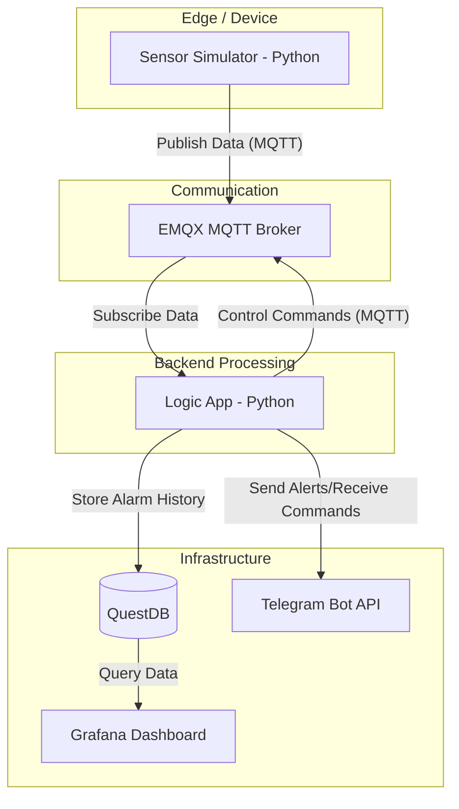

# Tele-Py-IoT-Practice

integrasi simulasi data sensor, broker MQTT (EMQX), pemrosesan logika backend, penyimpanan data time-series (QuestDB), serta mekanisme peringatan melalui Telegram (Telegram Bot API).

## Arsitektur Sistem



## Komponen Teknologi
- **Bahasa Pemrograman**: Python 3.x
- **MQTT Broker**: EMQX
- **MQTT Client**: MQTTX
- **Database**: QuestDB
- **Visualisasi**: Grafana
- **Integrasi**: Telegram Bot API
- **Infrastruktur**: Docker & Docker Compose

## Struktur File
- `sensor.py`: Simulator sensor DHT22 yang mengirimkan data suhu dan kelembapan secara acak. (menggantikan sensor fisik dan ESP32)
- `logic.py`: Pemroses logika utama yang memantau ambang batas suhu, mengelola database, dan berinteraksi dengan Telegram.
- `docker-compose.yml`: Konfigurasi kontainer untuk EMQX, QuestDB, dan Grafana.
- `.gitignore`: Konfigurasi untuk mengabaikan file yang tidak diperlukan dalam repositori.

## Panduan Instalasi dan Menjalankan Proyek

### 1. Prasyarat
- Docker dan Docker Compose terinstal.
- Python 3.x terinstal.

### 2. Menjalankan Infrastruktur
Jalankan perintah berikut untuk mengaktifkan broker dan database:
```bash
docker-compose up -d
```

### 3. Menjalankan Aplikasi
Buka dua terminal terpisah:

**Terminal 1 (Proses Logika):**
```bash
python logic.py
```

**Terminal 2 (Simulator Sensor):**
```bash
python sensor.py
```

## Fitur Utama
- Pemantauan suhu secara real-time.
- Kendali otomatis perangkat (simulasi kipas) berdasarkan ambang batas suhu.
- Riwayat alarm tersimpan dalam database QuestDB.
- Interaksi melalui Telegram menggunakan perintah `/status` dan `/stats`.
